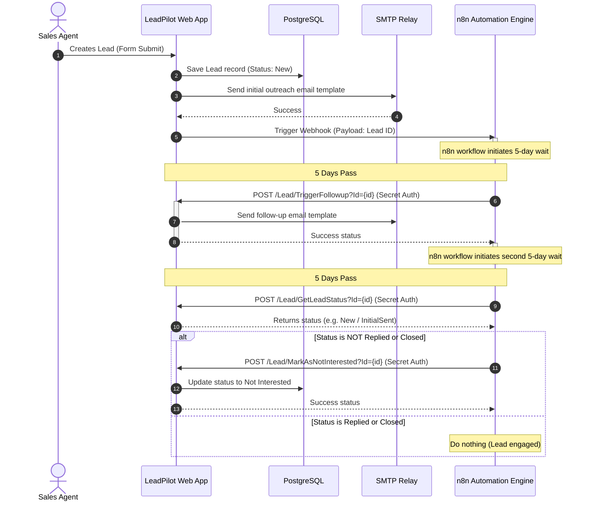

# LeadPilot

LeadPilot is a modern, secure, and mobile-responsive CRM platform designed to streamline lead acquisition, pipeline tracking, and automated communications. Built using ASP.NET Core 8.0 MVC, Entity Framework Core, and powered by an automated **n8n** orchestration engine, it features a glassmorphic dark-theme interface tailored for both desktop grids and mobile card viewports.

---

## 🚀 Key Features

* **Pipeline Stages Management**: Track leads through customizable statuses (`New`, `Initial Sent`, `Follow-up Sent`, `Replied`, `Closed`, `Do Not Contact`).
* **Interactive Analytics Dashboard**: Real-time KPI counters (Total leads, weekly conversion velocity) and graphical data distributions (status and source breakdowns via Chart.js).
* **Dual Viewport Layout**: Traditional jQuery DataTables on desktop; auto-renders into glassmorphic swipable mobile cards on small viewports (<768px).
* **Automated Drip Follow-ups**: Zero-maintenance lead nurturing loops driven by n8n webhooks.
* **Timing-Attack Immune Auth**: Secure login and registration powered by PBKDF2 (SHA-256) with constant-time cryptographic verification.

---

## 📐 Architecture & Workflow Diagram

---

## 🛠 Tech Stack

* **Backend**: ASP.NET Core 8.0 (MVC pattern), Entity Framework Core (Database-first mapping).
* **Database**: PostgreSQL.
* **Frontend**: Vanilla CSS (Custom Glassmorphism Design System), Bootstrap 5, jQuery, DataTables.net, Chart.js.
* **Integrations & Alerts**: SweetAlert2 (Dark theme popups), SMTP mail relay, n8n Webhooks.

---

## 📁 Repository Directory Structure

* [docs/Backend.md](docs/Backend.md): Database architecture, custom PBKDF2 authentication, and API endpoints map.
* [docs/Automation.md](docs/Automation.md): Detailed n8n workflow parameters, webhook security, and retry policies.
* [docs/DecisionLog.md](docs/DecisionLog.md): Architectural decisions (e.g., n8n vs. Hangfire).
* [docs/Challenges.md](docs/Challenges.md): Web design and scroll layout challenges, responsive card renderings, and webhook idempotency.
