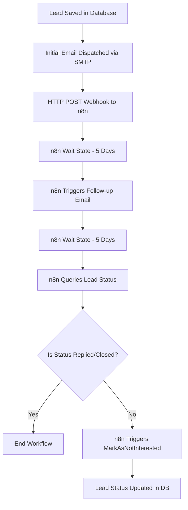

# Lead Pilot Automation & n8n Workflow

LeadPilot utilizes an automated asynchronous communication engine driven by **n8n** webhooks. This architecture ensures zero-maintenance lead engagement and follow-up loops.

---

## 1. Webhook Security
All automated API endpoints exposed in LeadPilot for the n8n orchestrator are protected via header-based shared secret validation:
* **Header Key**: `x-leadpilot-secret`
* **Configuration**: Verified against the `N8N:WebhookSecret` key in the application's configuration.
* **Access**: Actions (`TriggerFollowup`, `GetLeadStatus`, `MarkAsNotInterested`) require anonymous accessibility settings in ASP.NET Core, but will immediately reject requests (returning `401 Unauthorized`) if the secret key doesn't match.

---

## 2. Step-by-Step Lifecycle Workflow

1. **Webhook Trigger**: Once an initial email is successfully sent, LeadPilot POSTs the lead ID to the n8n webhook listener.
2. **First Wait State**: n8n pauses execution of that lead instance for 5 days.
3. **Follow-up Trigger**: After 5 days, n8n sends a POST request back to `/Lead/TriggerFollowup?Id={id}` (authorized via the shared secret). LeadPilot fires the second follow-up email.
4. **Second Wait State**: n8n pauses again for another 5 days.
5. **Status Query**: n8n calls `/Lead/GetLeadStatus?Id={id}` to fetch the current stage.
6. **Nurturing Resolution**:
   * If the lead responded (Status is `Replied` or `Closed`), the workflow terminates.
   * If the lead remains non-responsive, n8n calls `/Lead/MarkAsNotInterested?Id={id}` to flag the record status in the database.

---

## 3. Failure Handling & Production Recommendations
To prevent lead loss and communication failures, the n8n integration should incorporate robust error handling:
* **Recommended Retry Policies**: In production configurations, it is recommended that the n8n HTTP Request nodes be configured to retry (e.g., 3-5 retries with exponential backoff) if the LeadPilot web application is temporarily offline or undergoing maintenance.
* **Network Security Recommendations**: In production deployments, these webhook callback endpoints should be hosted behind an API gateway or secured via IP whitelisting to restrict traffic exclusively to the n8n cloud or hosting instances.
